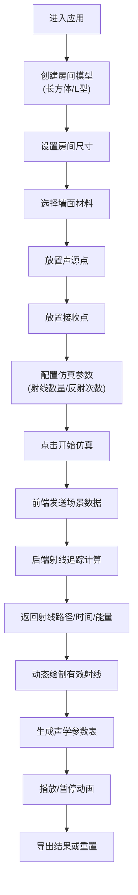

## 1. 产品概述

室内声学仿真辅助工具，帮助建筑声学设计师在设计阶段初步判断厅堂的声场分布特性。通过Web端3D可视化界面和后端射线追踪算法，快速模拟室内声波传播路径，直观呈现反射效果并输出关键声学参数。

- 核心价值：降低声学设计门槛，提供直观的声场可视化，辅助设计师快速验证空间声学方案
- 目标用户：建筑声学设计师、室内设计师、建筑系学生

## 2. 核心功能

### 2.1 用户角色
| 角色 | 注册方式 | 核心权限 |
|------|----------|----------|
| 访客用户 | 无需注册 | 使用全部仿真功能，导出计算结果 |

### 2.2 功能模块
1. **3D场景编辑器**：房间模型创建、声源/接收点放置、视角控制
2. **射线追踪仿真引擎**：后端声学计算服务
3. **结果可视化**：射线路径动画、声学参数展示
4. **参数控制面板**：材料属性、声源参数、仿真精度设置

### 2.3 页面详情
| 页面名称 | 模块名称 | 功能描述 |
|----------|----------|----------|
| 主工作区 | 3D视图 | Three.js渲染场景，支持鼠标拖拽旋转、滚轮缩放、右键平移 |
| 主工作区 | 左侧工具栏 | 房间类型选择（长方体/L型）、绘制模式切换、声源/接收点添加工具 |
| 主工作区 | 右侧参数面板 | 房间尺寸设置、墙面材料选择、声源强度、接收点灵敏度、仿真参数配置 |
| 主工作区 | 底部控制面板 | 开始仿真按钮、暂停/播放动画、重置场景、导出结果 |
| 主工作区 | 结果展示区 | 射线路径动态绘制、声学参数表（RT60、C50、D50等）、能量时间曲线 |

## 3. 核心流程

用户进入页面后，首先创建或选择房间模型，然后在空间内放置声源和接收点，配置材料和仿真参数，点击开始仿真后前端将场景数据发送至后端，后端执行射线追踪计算并返回结果，前端渲染射线路径动画并展示声学参数表。

## 4. 用户界面设计

### 4.1 设计风格
- **主色调**：深空蓝 (#0A1929) 作为背景，科技感青色 (#00D4FF) 作为高亮，橙色 (#FF6B35) 表示声源，绿色 (#00E676) 表示接收点
- **按钮风格**：扁平化设计，圆角4px，悬停时发光效果，点击时轻微凹陷
- **字体**：JetBrains Mono 作为数据显示字体，Inter 作为界面文本字体
- **布局风格**：深色主题专业软件布局，左侧工具栏、中央3D视图、右侧参数面板、底部控制栏
- **图标风格**：线性简约风格，使用Material Icons，保持一致的24px尺寸

### 4.2 页面设计概述
| 页面名称 | 模块名称 | UI元素 |
|----------|----------|--------|
| 主工作区 | 3D视图 | 半透明线框房间、发光球体声源、立方体接收点、网格地面、坐标轴辅助线 |
| 主工作区 | 左侧工具栏 | 垂直排列工具按钮，当前选中高亮显示，悬浮提示文字 |
| 主工作区 | 右侧参数面板 | 分组折叠面板、数值输入框带步进器、下拉选择框、滑块控件、实时参数更新 |
| 主工作区 | 底部控制栏 | 主操作按钮组、进度条、状态指示器、时间显示 |
| 主工作区 | 结果展示区 | 动态表格、能量曲线图表、可折叠参数详情 |

### 4.3 响应性
- 桌面端优先设计，最小支持1280px宽度
- 右侧参数面板可折叠，左侧工具栏可收起以扩大3D视图区域
- 所有控件支持键盘操作，数值输入支持Tab键切换

### 4.4 3D场景指导
- **环境**：深色背景配合雾效，营造沉浸式专业软件氛围，使用淡蓝色环境光
- **光照设置**：主光源平行光 + 半球光 + 点光源补光，确保3D物体层次分明
- **相机设置**：PerspectiveCamera，初始位置在房间斜上方45度，支持OrbitControls轨道控制
- **交互与动画**：声源/接收点选中时高亮闪烁，射线从声源发出后沿路径动画延伸，到达接收点时产生脉冲效果
- **后处理效果**：Bloom泛光效果使射线和点光源更有科技感，轻微的抗锯齿处理
- **性能预算**：射线数量默认1000条，最大5000条，反射次数最多8次，确保60fps帧率
