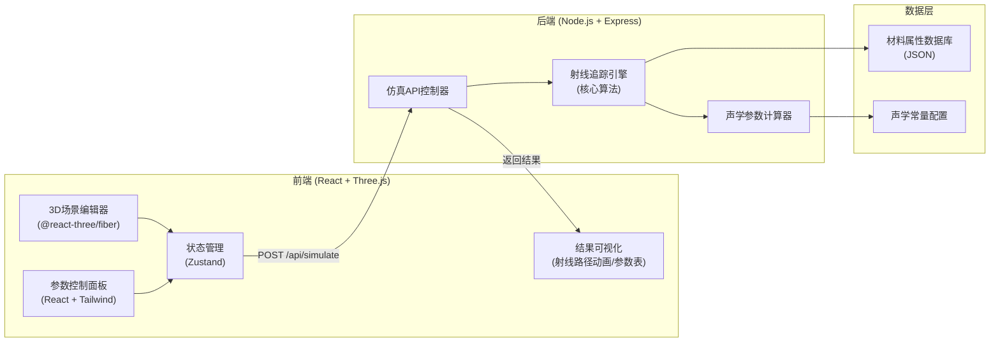
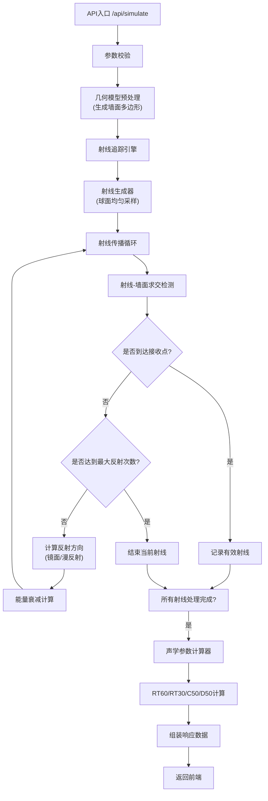

## 1. 架构设计

本项目采用前后端分离架构，前端负责3D场景渲染和用户交互，后端负责声学射线追踪计算。前后端通过RESTful API通信。



## 2. 技术描述

### 2.1 前端技术栈
- **框架**: React@18 + TypeScript
- **构建工具**: Vite@5
- **3D渲染**: three@0.160, @react-three/fiber@8.15, @react-three/drei@9.92, @react-three/postprocessing@2.15
- **状态管理**: zustand@4.4
- **样式**: tailwindcss@3.4
- **UI组件**: lucide-react@0.294 (图标)
- **图表**: recharts@2.10 (能量时间曲线)

### 2.2 后端技术栈
- **运行时**: Node.js@20
- **框架**: Express@4.18
- **类型支持**: TypeScript@5.3
- **CORS**: cors@2.8.5
- **数学计算**: 原生JavaScript实现向量运算

### 2.3 项目目录结构
```
tss24/
├── client/                    # 前端项目
│   ├── src/
│   │   ├── components/        # React组件
│   │   │   ├── Editor/        # 3D编辑器相关
│   │   │   ├── Toolbar/       # 工具栏
│   │   │   ├── Panel/         # 参数面板
│   │   │   └── Results/       # 结果展示
│   │   ├── store/             # Zustand状态管理
│   │   ├── types/             # TypeScript类型定义
│   │   ├── utils/             # 工具函数
│   │   └── App.tsx
│   └── package.json
├── server/                    # 后端项目
│   ├── src/
│   │   ├── controllers/       # API控制器
│   │   ├── services/          # 业务逻辑
│   │   │   ├── RayTracer.ts   # 射线追踪核心
│   │   │   └── Acoustics.ts   # 声学计算
│   │   ├── data/              # 材料数据
│   │   ├── types/             # 类型定义
│   │   └── server.ts
│   └── package.json
└── .trae/documents/           # 项目文档
```

## 3. 路由定义

| 路由 | 用途 |
|------|------|
| / | 主应用页面，3D编辑器 + 参数面板 |
| POST /api/simulate | 提交仿真任务，返回计算结果 |

## 4. API定义

### 4.1 仿真请求类型定义
```typescript
// 3D点坐标
interface Point3D {
  x: number;
  y: number;
  z: number;
}

// 房间模型
interface Room {
  type: 'box' | 'l-shape';
  dimensions: {
    width: number;   // X轴
    height: number;  // Y轴
    depth: number;   // Z轴
    lExtension?: number;  // L型延伸长度
    lWidth?: number;      // L型延伸宽度
  };
  walls: Wall[];
}

// 墙面
interface Wall {
  id: string;
  vertices: [Point3D, Point3D, Point3D, Point3D];
  material: Material;
}

// 材料属性
interface Material {
  name: string;
  absorption: number;  // 吸声系数 0-1
  reflection: number;  // 反射系数 0-1
  diffusion: number;   // 漫反射比例 0-1
}

// 声源
interface Source {
  position: Point3D;
  power: number;      // 声源强度 dB
}

// 接收点
interface Receiver {
  position: Point3D;
  radius: number;     // 接收半径
}

// 仿真参数
interface SimulationParams {
  rayCount: number;          // 射线数量
  maxReflections: number;    // 最大反射次数
  soundSpeed: number;        // 声速 m/s
  frequency: number;         // 参考频率 Hz
}

// 仿真请求
interface SimulationRequest {
  room: Room;
  sources: Source[];
  receivers: Receiver[];
  params: SimulationParams;
}
```

### 4.2 仿真响应类型定义
```typescript
// 单条射线
interface RayPath {
  id: string;
  sourceId: string;
  receiverId: string;
  points: Point3D[];       // 路径点（包括反射点）
  reflectionCount: number; // 反射次数
  timeDelay: number;       // 到达时间 ms
  energy: number;          // 到达能量 相对值
  reflectionTypes: ('specular' | 'diffuse')[]; // 每次反射类型
}

// 接收点结果
interface ReceiverResult {
  receiverId: string;
  rays: RayPath[];
  totalEnergy: number;
  earlyEnergy: number;     // 50ms内能量
  lateEnergy: number;      // 50ms后能量
}

// 声学参数
interface AcousticParams {
  rt60: number;            // 混响时间 s
  rt30: number;            // 混响时间RT30 s
  c50: number;             // 清晰度指数 dB
  d50: number;             // 语言清晰度 %
  t20: number;             // 早期衰变时间 s
}

// 仿真响应
interface SimulationResponse {
  success: boolean;
  results: ReceiverResult[];
  acousticParams: AcousticParams;
  stats: {
    totalRays: number;
    effectiveRays: number;
    computeTime: number;   // 计算耗时 ms
  };
}
```

## 5. 后端服务架构



## 6. 核心算法模型

### 6.1 射线追踪核心算法
```typescript
// 射线-三角形相交检测 (Möller-Trumbore算法)
function rayTriangleIntersect(
  origin: Point3D, 
  dir: Point3D, 
  v0: Point3D, 
  v1: Point3D, 
  v2: Point3D
): { t: number; u: number; v: number } | null {
  // 实现快速相交检测
}

// 镜面反射方向计算
function specularReflect(incoming: Point3D, normal: Point3D): Point3D {
  const dot = incoming.x * normal.x + incoming.y * normal.y + incoming.z * normal.z;
  return {
    x: incoming.x - 2 * dot * normal.x,
    y: incoming.y - 2 * dot * normal.y,
    z: incoming.z - 2 * dot * normal.z
  };
}

// 漫反射方向生成 (余弦加权半球采样)
function diffuseReflect(normal: Point3D): Point3D {
  // 使用随机数生成半球方向
}

// 能量衰减计算
function calculateEnergy(
  initialEnergy: number,
  distance: number,
  reflectionCount: number,
  materials: Material[]
): number {
  // 距离衰减 + 反射衰减
  const distanceAttenuation = 1 / (distance * distance);
  let reflectionAttenuation = 1;
  for (const mat of materials) {
    reflectionAttenuation *= mat.reflection;
  }
  return initialEnergy * distanceAttenuation * reflectionAttenuation;
}
```

### 6.2 声学参数计算
```typescript
// RT60估算：基于Sabine公式或能量衰减曲线
function calculateRT60(energyDecayCurve: number[], timeStep: number): number {
  // 找到-5dB到-35dB的线性区段，外推至-60dB
}

// C50 = 10 * log10(早期能量 / 晚期能量)
function calculateC50(rays: RayPath[]): number {
  const early = rays.filter(r => r.timeDelay <= 50).reduce((sum, r) => sum + r.energy, 0);
  const late = rays.filter(r => r.timeDelay > 50).reduce((sum, r) => sum + r.energy, 0);
  return 10 * Math.log10(early / late);
}

// D50 = 早期能量 / 总能量 * 100%
function calculateD50(rays: RayPath[]): number {
  const early = rays.filter(r => r.timeDelay <= 50).reduce((sum, r) => sum + r.energy, 0);
  const total = rays.reduce((sum, r) => sum + r.energy, 0);
  return (early / total) * 100;
}
```

### 6.3 材料数据库
```json
{
  "materials": [
    { "name": "混凝土", "absorption": 0.02, "reflection": 0.98, "diffusion": 0.1 },
    { "name": "砖墙", "absorption": 0.05, "reflection": 0.95, "diffusion": 0.15 },
    { "name": "石膏板", "absorption": 0.1, "reflection": 0.9, "diffusion": 0.2 },
    { "name": "木板", "absorption": 0.15, "reflection": 0.85, "diffusion": 0.25 },
    { "name": "地毯", "absorption": 0.4, "reflection": 0.6, "diffusion": 0.8 },
    { "name": "玻璃", "absorption": 0.03, "reflection": 0.97, "diffusion": 0.05 },
    { "name": "吸声棉", "absorption": 0.8, "reflection": 0.2, "diffusion": 0.9 },
    { "name": "窗帘", "absorption": 0.5, "reflection": 0.5, "diffusion": 0.7 }
  ]
}
```
